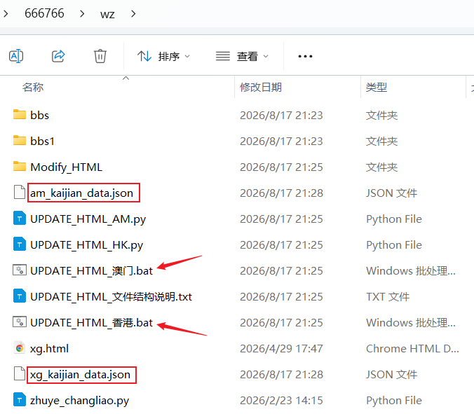
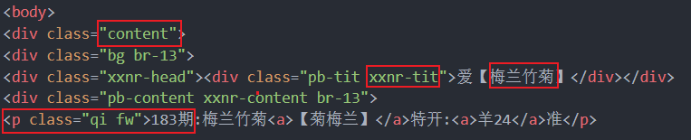

## 📁 文件结构
```
web/
├── UPDATE_HTML_澳门.bat          # 双击运行澳门自动化程序 
├── UPDATE_HTML_香港.bat          # 双击运行香港自动化程序
├── UPDATE_HTML_AM.py             # AM主程序
├── UPDATE_HTML_HK.py             # HK主程序
├── main.html                     # 主页
├── am_kaijian_data.json          # AM开奖记录
├── xg_kaijian_data.json          # HK开奖记录
├── bbs1/                         # bbs1页面html文件夹
├── bbs/                          # bbs页面html文件夹
├── Logs/                         # 日志文件夹
└── Modify_HTML/                  # 核心文件夹（文件夹下内容禁止修改）
    └── config.py                 # 配置文件
    └── bbs_processors            # 对应bbs页面python处理程序
    └── bbs_processors_HK         # 对应bbs1页面python处理程序
```
如图所示: <br> 

<br>

## 🚀 快速开始

### 步骤
解压后，把 `UPDATE_HTML...` 和 `Modify_HTML` 文件夹拷贝到网站（`main.html`、`bbs` 、`bbs1`文件夹）同一层目录，见以上文件结构。  
双击 `UPDATE_HTML_AM.bat` 或 `UPDATE_HTML_AM.bat`即可运行。


> | 事项                       | 说明     | 操作                        |
> | -------------------------- | -------- | --------------------------- |
> | **UPDATE_HTML_AM.bat**     | 脚本文件 | 📍 双击运行程序              |
> | **Modify_HTML 文件夹**     | 核心文件 | 🚫 禁止修改任何文件          |
> | **Logs 文件夹**            | 日志文件 | 📁 可删，每次运行时会自动创建  |
> | **数据 kaijian_data.json** | 数据文件 | 📊 按实际修改，JSON 标准格式 |


<br>

**⚠️ 重要注意事项**
> **环境要求**  
> 需要安装 Python 3.13 来运行脚本  
> 下载地址：https://www.python.org/ftp/python/3.13.6/python-3.13.6-amd64.exe
>
> **版本检查**  
> 检查已安装版本，星号 * 表示当前默认版本  
> ```cmd
> py -0
> ```
>
> **多版本配置**  
> 如果有多个版本，且星号 * 不在 3.13 这一行：
>
> 1. 在 `C:\Windows` 下创建 `py.ini`
> 2. 添加内容：
>    ```ini
>    [defaults]
>    python=3.13
>    ```
>
> **或使用完整路径**  
> 用 `set path` 查看 Python 安装路径，然后使用完整路径：  
> ```bash
> "D:\Program Files\Python313\python.exe" UPDATE_HTML_AM.py
> "D:\Program Files\Python313\python.exe" UPDATE_HTML_HK.py
> pause
> ```

<hr>

## 🧩 删除规则：
```
A、【全部功能块】：
1. 如果仅有一期且开错，删除
2. 三期连错，删除所有期

B、【平特功能块】 'IS_PT' ：
1. 如果当期开错，且跟前一期不连续，删除所有期
2. 仅有两期时，第一期开对，第二期开错，删除所有期
3. 最新的两期为错，且所有错的期数大于对的期数，删除所有期
4. 最新的两期为错，且所有错的期数小于对的期数，删除所有'错'的期数


C、【中特功能块】：
1. 中特8, 8-9肖, 错>=1/3，删除所有期 ('IS_ZT8')
    1.1只要当期开错，立即删除当期 ('IS_ZT8_1')
    1.2只要当期开错，立即删除当期；连错两期，删所有纪录 ('IS_ZT8_2')
2. 中特5, 6-7肖, 错>=1/2，删除所有期 ('IS_ZT5' )
    2.1只要当期开错，立即删除当期 ('IS_ZT5_1'), 像'独家玄机'
3. 中特4, 1-5肖, 错>1/2，删除所有期 ('IS_ZT4')
4. 针对多期一轮。只要当期开错，立即删除当期，最新的两期为错，删除所有期 ('IS_ZT2_1')。
    4.1对多期一轮这种，错一轮删掉所有期数('IS_ZT2_2')。
5. 最新期开错，最近两期不连续，删除'最新'期
6. 最新期开错，且之前的期数中有缺失期数，删除'最新'期
7. 最新的两期为错，删除所有'错'的期数

D、【普通功能块】：
1. 最新的两期为错，删除所有'错'的期数
2. 最新期开错，最近两期不连续，删除'最新'期
3. 最新期开错，且之前的期数中有缺失期数，删除'最新'期

E、【其它】：
1. ①肖①码，当期未中时，删除
2. 一肖一码，当期未中时，删除
3.玄机解特, 保留最新的10期 ('IS_10')
```

### 删除规则解释
```
processors文件夹中python文件最后的字段，表示应用的删除规则，如：
('content', '平特xx', True, 'IS_PT')，
表示应用的删除规则为'IS_PT' ，对照前面给出的删除规则 ，A、B 都生效：
A、【全部功能块】：
1. 如果仅有一期且开错，删除
2. 三期连错，删除所有期

B、【平特功能块】 'IS_PT' ：
1. 如果当期开错，且跟前一期不连续，删除所有期
2. 仅有两期时，第一期开对，第二期开错，删除所有期
3. 最新的两期为错，且所有错的期数大于对的期数，删除所有期
4. 最新的两期为错，且所有错的期数小于对的期数，删除所有'错'的期数


('content', '32码中特', True, 'IS_ZT8')，
表示应用的删除规则为'IS_ZT8' ，对照前面给出的删除规则 ，A、C1/5/6/7生效：
A、【全部功能块】：
1. 如果仅有一期且开错，删除
2. 三期连错，删除所有期

C、【中特功能块】：
1. 中特8, 8-9肖, 错>=1/3，删除所有期 ('IS_ZT8')
5. 最新期开错，最近两期不连续，删除'最新'期
6. 最新期开错，且之前的期数中有缺失期数，删除'最新'期
7. 最新的两期为错，删除所有'错'的期数
```


## 📝 关于提问题，请明确功能块位置, 可参考如下：
```
必须明确功能块位置， 如 365/bbs/016.html

详细问题描述，想要达到什么样的效。如：
[平码特码] 只需要特码不用关注平码，
[高亮] 生肖或数字在开奖中时，进行高亮。
[删除规则] 连续两期出错时，需要删除所有出错的记录。

```

## ✂️ 常见问题的处理(重点)：
> 发现问题请查看日志。在最新的日志中，搜索对应html的文件名，如："BBS004" 或是功能块名称"左拥右抱"，查看报错的原因。<br>
> 如果能找到原因并处理后，请及时告知我，方便下次发版时进行更正 <br>
> 检查json文件，有无包含错误字符，不相关字符，不合规期数等 <br>
> 检查python的版本，是不是Python 3.13 <br>
```
>>>>> 在BBS或是BBS_HK中，找到html同名的python文件，如香港001.html对应BBS_HK中BBS001.py
>>>>> 建议：每次修改前，先复制备份一下html原文件包。
1.防止操作失误时，用备份包继续改，
2.发现问题，直接把备份包给到我，我这边跑一下让问题复现，方便最快地找到问题的原因。

1.测试教程
把我的程序包，解压到web目录，如果没有最新期的开奖数据，就复制一个之前的，把期数改一下就好。
啥也不用改，直接双击bat文件，看看结果。
主要看有没有报 error 错误
对照日志，随机抽几个功能块，看有没有更改成想要的结果

2.该删的期数没删，或是删除的内容跟预期的不一致。
在python文件的block_configs中找到('xxnr', '跑来跑去', None, True, 'IS_PT')，
最后一个字段'IS_PT'对应着删除规则，修改为对应的规则就好

3.日志提示无需修改HTML文件
检查python文件最后一行 return True，是否被注释#，如果是，就把'#'去掉
如果是"已存在相同的内容"，说明这个html这期已被修改过了。替换掉html内容即可

4.提示"未找到对应数据"
搜索字典中 kaijian_data.py 中，是否有对应字段。
如html中给出的内容是 <p >341期:成语<a><s></s>【明明白白】</a><f>开:<a>？00</a>准</f></p>
在字典中 kaijian_data.py 搜"明明白白"，发现get_abc这个函数中字段不存在，就需要补全字典。
或是【明明白白】写成了 【明明——白白】就需要修改html文件为正确的内容。

在对应的python中，也可找到调用的是哪个函数 kd.get_abc(edf)，在kaijian_data.py中找到这个函数，
abc = {
    "牛": {"哭来哭去呀", "明明白白呀"},
    "猪": {"高高兴兴呀", }
}
def get_abc()
```

<br>



> 如图，画框的这四个地方，是用来定位功能块位置的，不能变动。如需要改动，请提前告知我。
<br>

### 🐬 json文件标准格式
```json
{
  "ABCrecords": [
    {
      "period": "001期",
      "zodiacs": [
        {"name": "n1", "number": "01"},
        {"name": "n2", "number": "02"},
        {"name": "n3", "number": "03"}
      ]
    },
    {
      "period": "002期",
      "zodiacs": [
        {"name": "n1", "number": "01"},
        {"name": "n2", "number": "02"},
        {"name": "n3", "number": "03"}
      ]
    },
    {
      "period": "003期",
      "zodiacs": [
        {"name": "n1", "number": "01"},
        {"name": "n2", "number": "02"},
        {"name": "n3", "number": "03"}
      ]
    }
  ]
}
```
